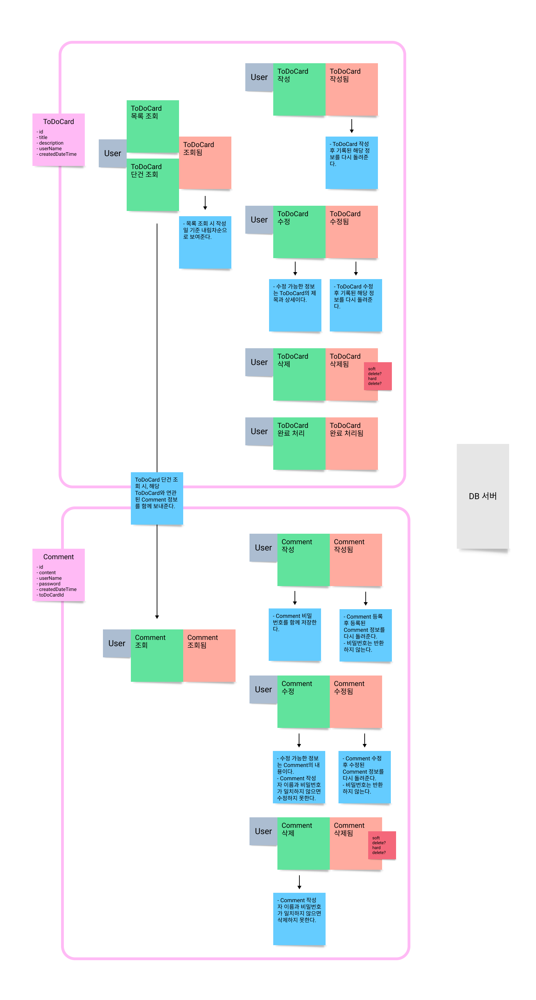
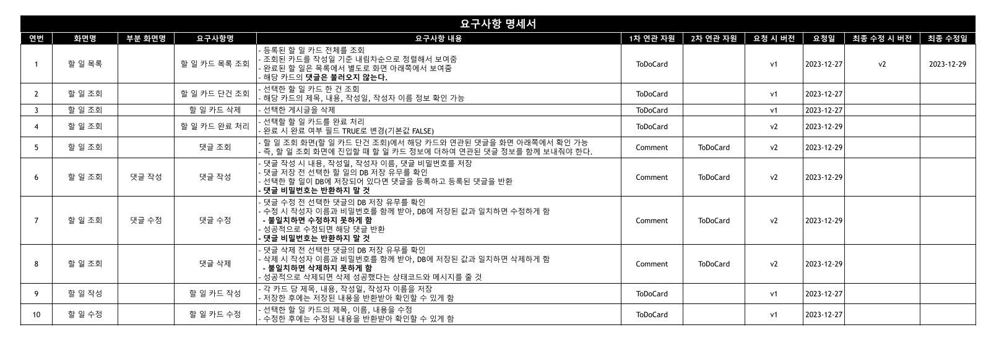
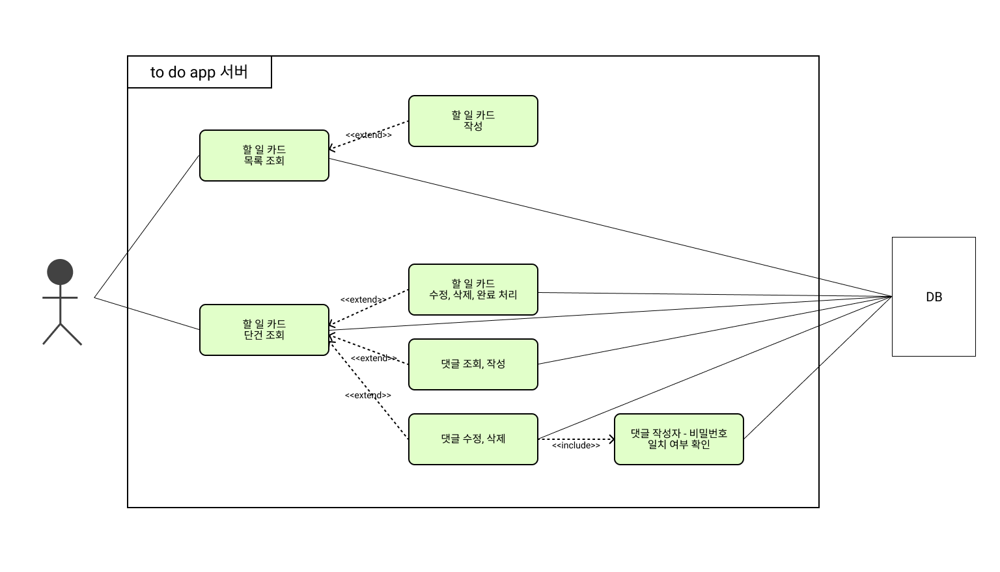
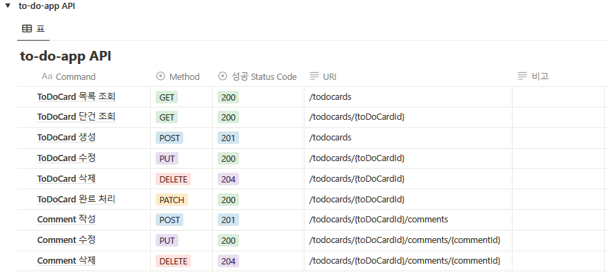

# 내일배움캠프 Kotlin 1기 과제 제출용 리포지토리
- 프로그래밍 기초 개인 과제: week2 모듈
- 프로그래밍 심화 개인 과제: week3 모듈
- 주특기 숙련 개인 과제: week4 모듈

## 주특기 숙련 개인 과제 - to do 앱 백엔드 서버 만들기
### event storming $\color{#dd6565}\-\ 2023.12.29. 변경$

### step1, step2 요구사항 $\color{#dd6565}\-\ 2023.12.29. 변경$
- 할 일 카드 목록 조회, 할 일 카드 단건 조회, 할 일 카드 작성, 할 일 카드 수정, 할 일 카드 삭제, 할 일 카드 완료
- 댓글 조회, 댓글 작성, 댓글 수정, 댓글 삭제

### usecase diagram $\color{#dd6565}\-\ 2023.12.29. 변경$

### API 명세 $\color{#dd6565}\-\ 2023.12.30. 변경$

### entity relationship diagram $\color{#dd6565}\-\ 2023.12.30. 변경$

### API 및 비즈니스 로직 구현 → week4 모듈 코드
- 2023.12.29. step1 구현
  - [PR](https://github.com/rugii913/KotlinAssignment/pulls?q=to-do-app+is%3Apr+is%3Aclosed) 및
[프로젝트](https://github.com/users/rugii913/projects/8) 참고 

---

  

    <h2>(지난 과제 README) 프로그래밍 심화 개인 과제</h2>
  

  

### 요구사항(Lv1 ~ Lv3)
- 메인 메뉴판과 상세 메뉴판
  - 입력받은 숫자에 따라 다른 로직을 실행(if, when을 활용)
  - 반복문을 이용해서 특정 번호가 입력되면 프로그램을 종료
     

- 필요한 클래스 설계(버거, 아이스크림, 음료, 맥주, 주문, 공통 등) - 주문, 결제 등은 Lv1 ~ Lv3 구현 후 설계
  - 클래스들의 프로퍼티와 메서드를 정의
  - 설계한 클래스들이 상속 관계를 가지도록 함
  - 하나의 리스트 객체로 모든 메뉴들을 관리하도록 함
     

### 추가 요구 사항(Lv4 ~ Lv5): 위 1, 2 요구사항까지 구현하고 난 후에 구현할 것
- 예외처리: 숫자 입력 필요한 곳에 문자 입력된 경우
- 현재 잔액과 가격을 비교하여 구매 가능한 상태를 정의
- 특정 작업이 종료된 후, 3초 뒤에 다른 작업을 수행하게 함
- 결제 시 현재 시간과 비교, 특정 시간대에는 결제할 수 없다는 알림창을 띄워줌
- 프로그램을 종료할 때까지 5초마다 현재 주문 대기수를 실시간으로 출력

~~### 유스케이스 - TODO~~

~~### 클래스 다이어그램 - TODO~~

  

